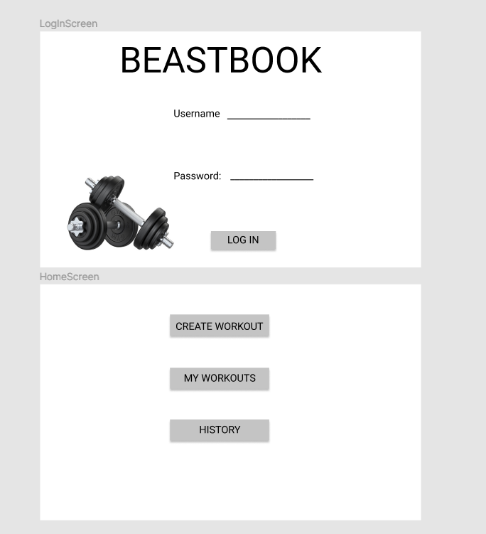
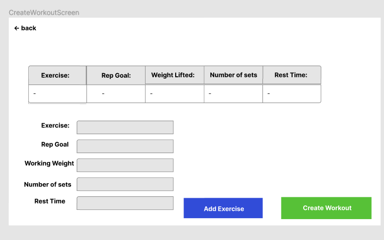
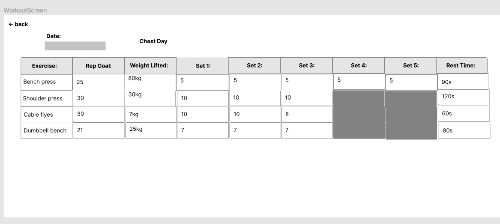
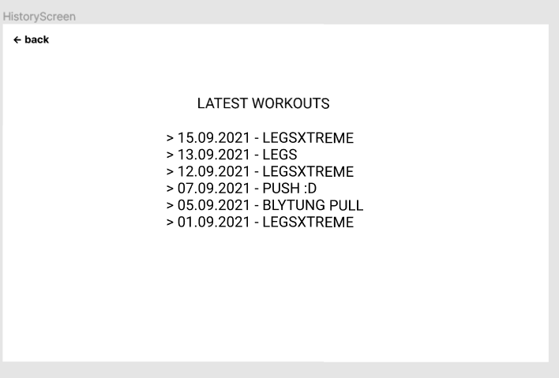
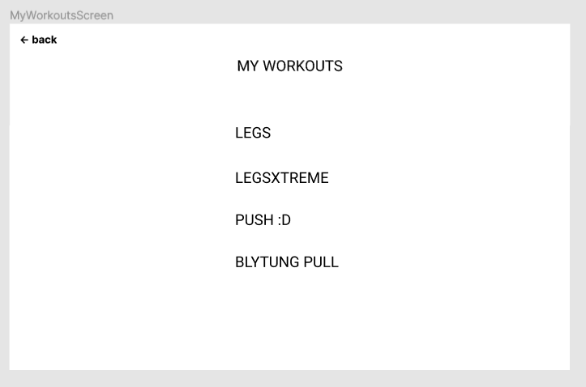

# BeastBook Application
This project is about an app where you can keep track of your workouts.
This is how we have imagined our final project to be.
It should be possible to ...
- create a new workout
- open a saved workout
- look at your workout log 
- import and export workouts

When you create a workout it contains ...
- exercise name
- rep goal
- working weight
- number of sets
- rest time.

When you log your workout you add in the number of reps taken on each set. 
The following is an illustration of our final product

</img>
</img>
</img>
</img>
</img>

# Minimum viable product
Release 1 does not contain all these attributes. It contains ...
- HomeScreen
- CreateWorkoutScreen

In this MVP it is possible to create a workout by adding one exercise at a time. There are some minimal requirements to a exercise and a workout. If you dont meet these requirements, you will get feedback. Eg. if you type in a wrong format (eg. String instead of int in working weight), an Exception will be thrown. For the user, only a red text with feedback will appear on the screen until you have typed a exercise in the correct format. 
The idea behind this MVP is that your workouts will be saved. Eg. if you have created a workout and then close the app, you should be able to open the app the next day and see that your workout is still there.

# Developer installation
To install the project, type `git clone https://gitlab.stud.idi.ntnu.no/it1901/groups-2021/gr2132/gr2132.git`

# How to build and run the project
We use maven to build and run this project
To build the project, type `cd beastBook` and then `mvn install`.
To run the project, type `cd fxui` and then `mvn java:fx`, or `mvn javafx:run -f fxui/pom.xml`
