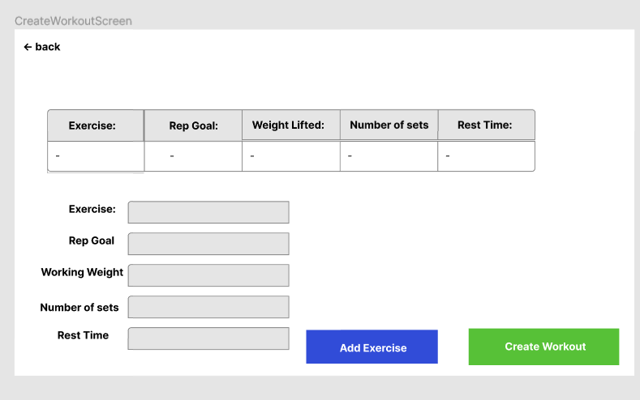
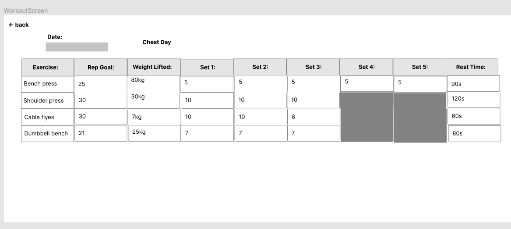
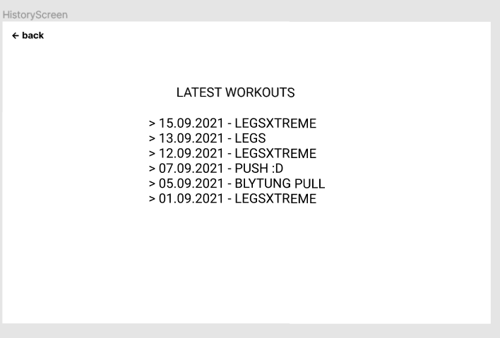
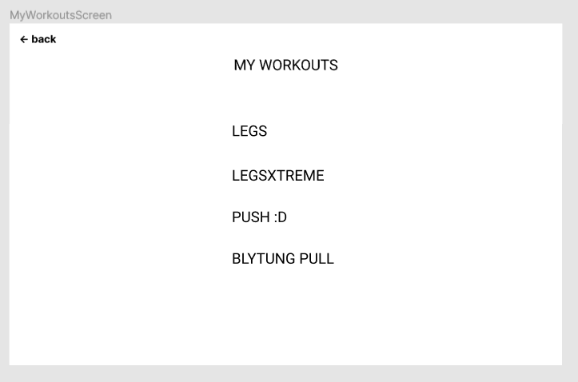

# BeastBook Application
This project is about an app where you can keep track of your workouts.
You can
- create a new workout
- open a saved workout
- look at your workout log 
- import and export workouts

When you create a workout it contains

- exercise name
- rep goal
- working weight
- number of sets
- rest time.

When you log your workout you add in the number of reps taken on each set. 

</img>
</img>
</img>
</img>
</img>

