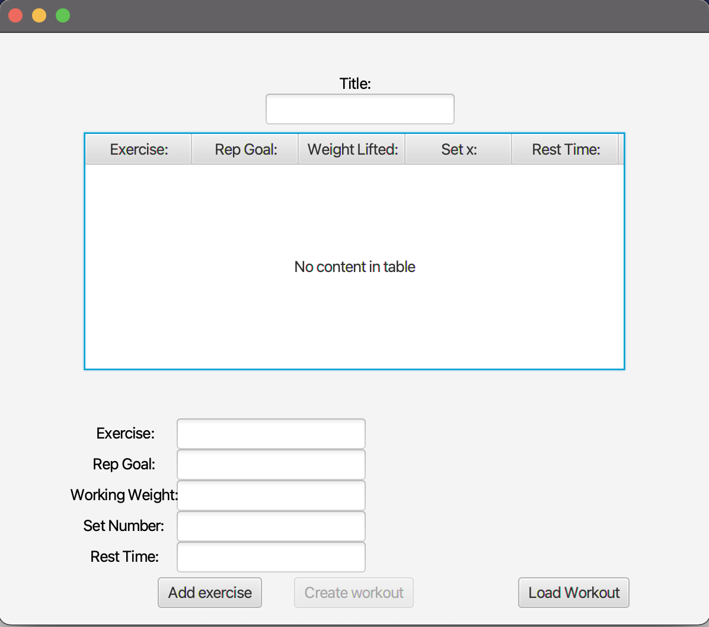
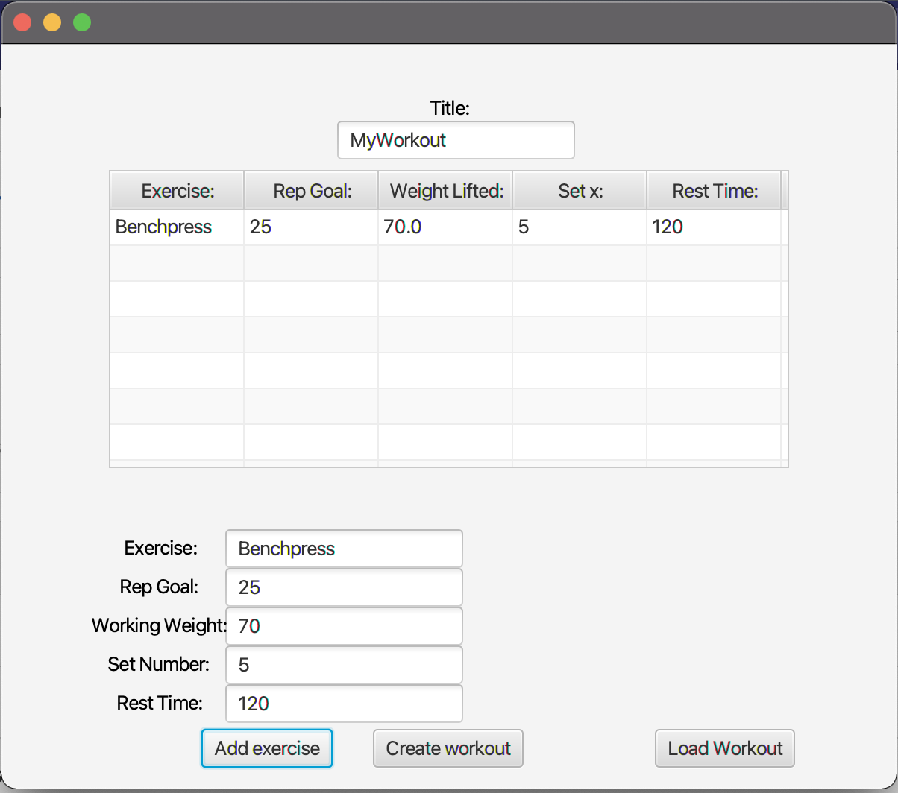
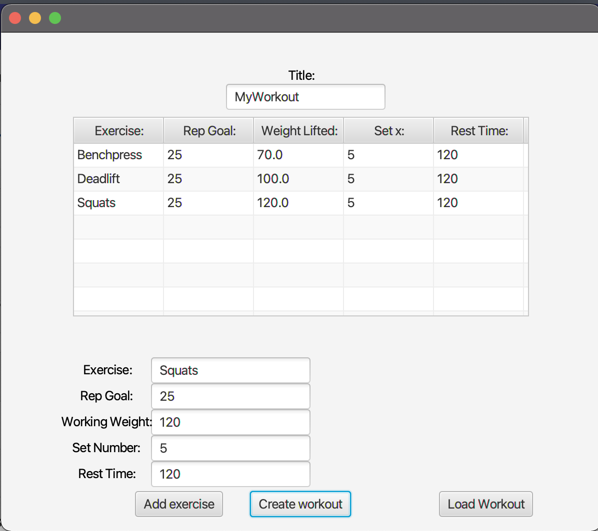
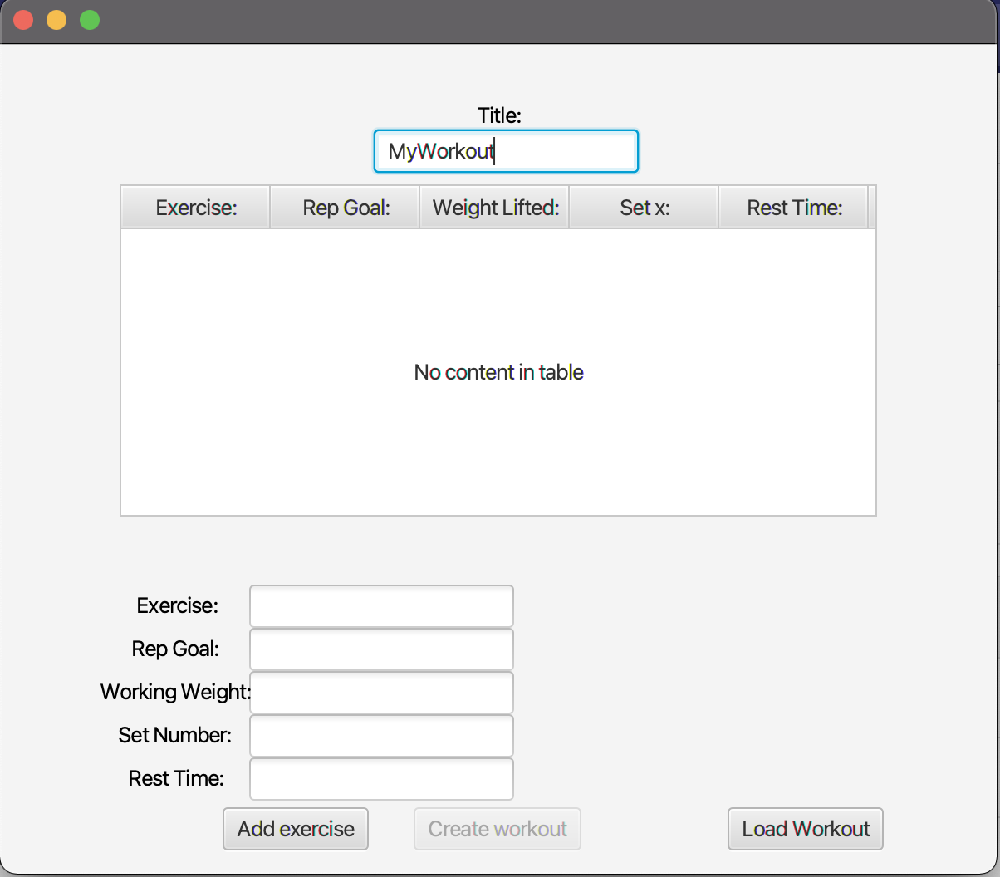
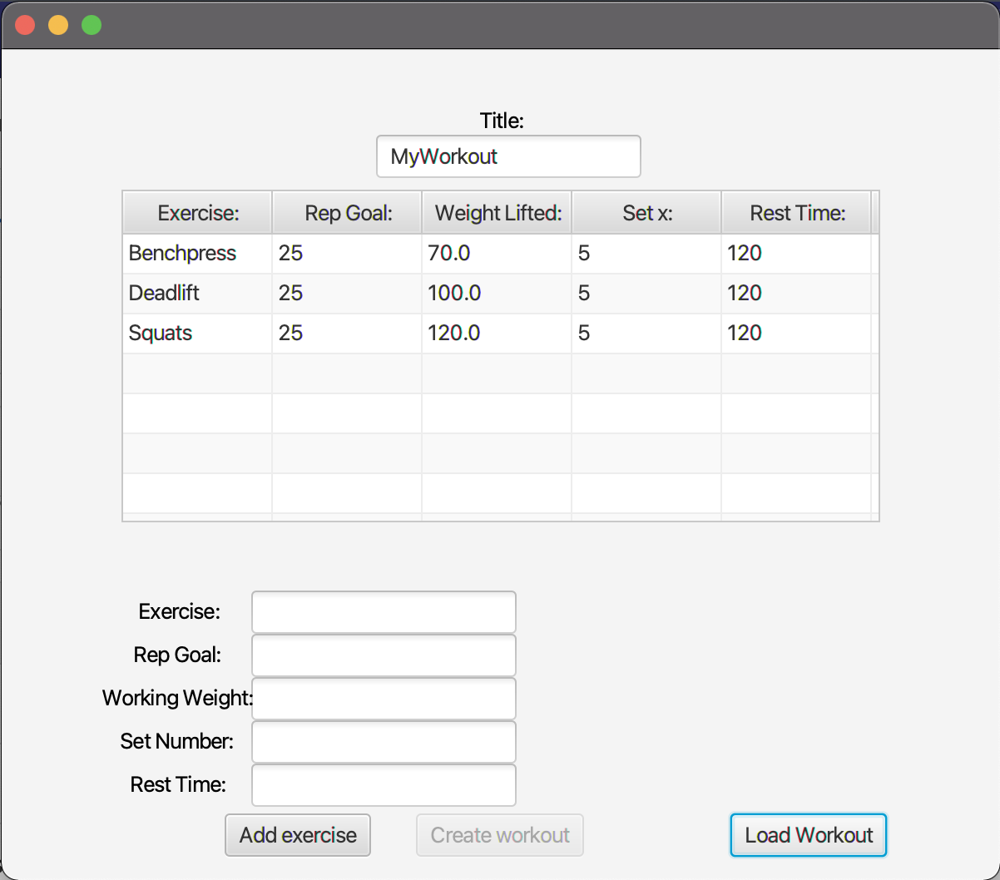

# Release 1

In this MVP it is possible to create a workout by adding one exercise at a time. 

<h5>This is your start screen when loading the app: </h5>

 <h5>To add a exercise, simply type in the input fields the name of the exercise, number of reps, working weight, number of sets and rest time. </h5> 
If you don’t meet the requirements for adding an exercise and/or a workout, you will get feedback. If you type in a wrong format (e.g. String instead of int in working weight), an Exception will be thrown. For the user, only a red text with feedback will appear on the screen until you have typed an exercise in the correct format. If you try to create a workout without adding a title, a red text will appear with this exact message.

 <h5>When you have added all your exercises, simply click the create workout button, and a file will be saved with the title of your workout as filename + ".txt": in a generated folder ("gr2132/beastBook/core/sampleData")</h5>

 <h5>The idea behind this MVP is that your workouts will be saved so that you can load them later. When opening your saved workouts, you need to type in the corresponding name of the workout and click “Load Workout”. Your saved workout will then load. </h5>

 <h5>If you loaded your workout successfully (feedback will appear on the screen if something failed), all your exercises in the workout will appear in the table again:  </h5>

