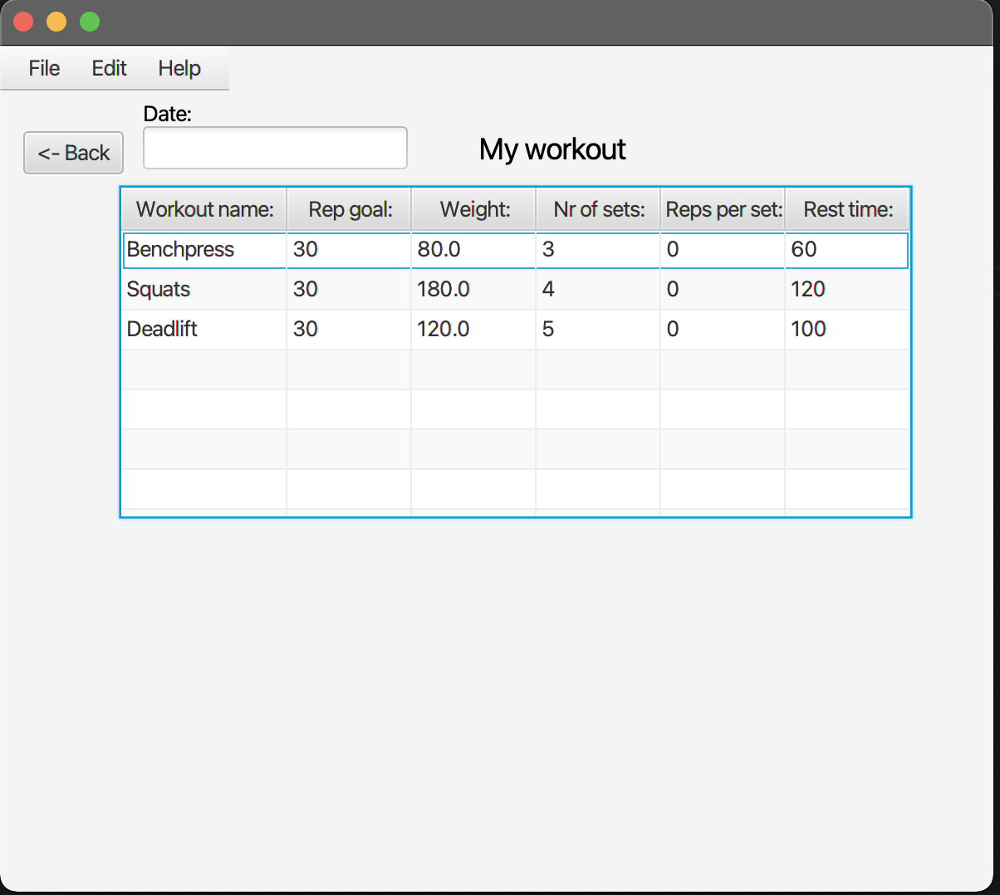

# Release 2

In this release, it is possible to create a user. Furthermore, a workout which is created, will be registered on the logged in user.
The user can view all the workouts which have been saved. From the overview, it is possible to select a workout from the saved workouts. 
When a workout is clicked, a new window opens with the selected workout. The user can then edit the exercises to the workout in this window.

<h5>This is your start screen when loading the app: </h5>

<h5>Here is it possible to either log in with an already registered user or create a new one. </h5> 

To register a user, simply type in your username and password and then click "Register". 
To log in, type in your username and password, and hit "Log in"

<h5>This is the main menu. </h5> 

Here is it possible to navigate to create a new workout or view your saved workouts.

<h5>This is how the user can create a workout.</h5> 

Click [here](docs/release1/README.md) for a description of how to create a workout. 

<h5>When "My Workouts" is clicked in the main menu, an overview of the user's workouts is shown.</h5> 

The clicked workout is then loaded. 

<h5>The selected workout then shows all the exercises in the workout.</h5> 

In the next release, the "reps per set" column and the date can be used to log the workout and keep track of your progress. 

<h5>The user can edit exercise names, rep goal, weight, number of sets and rest time.</h5> 

The meaning with this feature is to update your workout if you manage to progress in terms of weight etc. The edited values will be saved. When the user vists the workout the next time, the updated value will be shown. 

If the user type in a value in wrong format, the value will not be saved. An exception will appear on the screen until a valid value is typed in.

<h5>Log out</h5> 

The user can log out of the application at any point. Move the cursor to "File" and hit "Log Out" 

