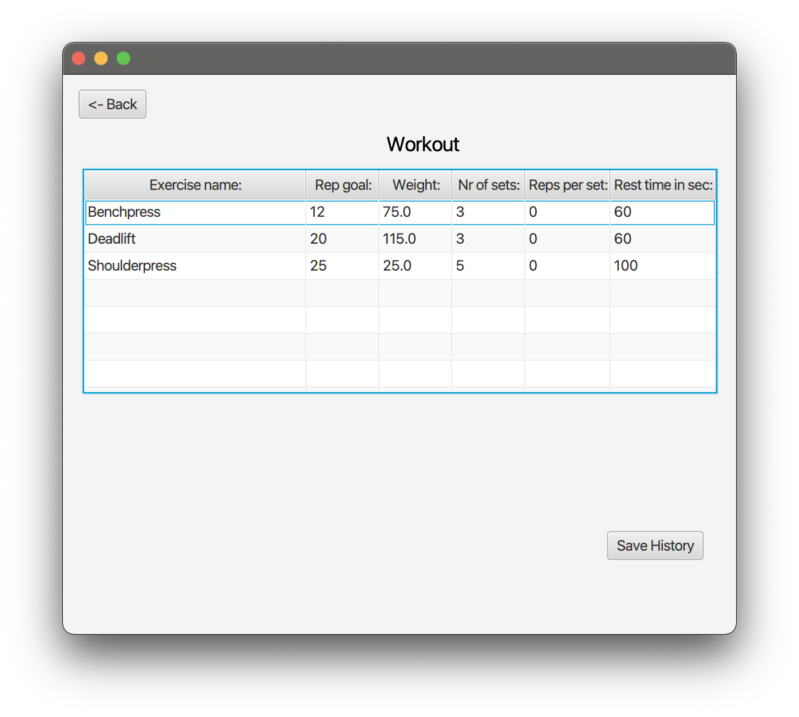
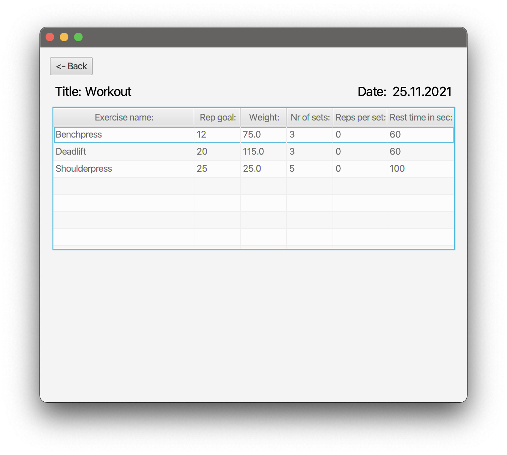

# Release 3 

In our final release, it is possible to log your workouts (we call the logged workouts for history) including the functionality from release 2. Furthermore, it is possible to delete exercises, histories and workouts. It is also possible to delete your user. 

<h5>This is your start screen when loading the app: </h5>

 Log in will log in after correct username and password is typed in. Register will automatically log in the new registered user. 

<h5>This is your screen after logging in:</h5>

It is possible to click to create a workout, view your workouts and also view your history.

<h5>Delete user is now possible</h5>

When the highlighted button is clicked,  the user and the user's data is gone forever!

<h5>It is now possible to delete exercises from your workout:</h5>

 To see how to create and load a workout, click [here](docs/release1/README.md). The delete functionality is not shown in the "guide", but to delete a exercise, select a exercise in the table, and then hit "Delete exercise".

<h5>Exercise deleted!</h5>

<h5>This is the overview of your saved workouts.</h5>

 Here, it is possible to open a selected workout or delete the selected workout.

<h5> After a workout is opened, more data is possible to view.</h5>

 To get to know how to edit exercises, click [here](docs/release2/README.md) for a guide. In this release, it is possible to track your workouts over time.
When "Save History" is clicked, the workout is logged to History Overview, with its data(exercises, name and current date). 
It is only possible to save the same workout one time per day to  history.

<h5> The workout and it's data was logged!</h5>

<h5> To view your older workouts, head over to the History overview</h5>

 It is also possible to both open and delete workouts saved to history.

<h5>Your saved workout with the date it was logged!</h5>

 It is not possible to changed the data of a logged workout.

